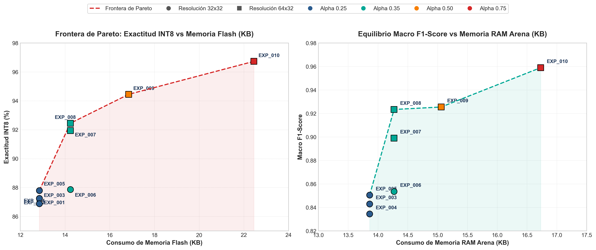

# Architectural & Resource Comparison: Standard MobileNet vs. Custom Micro-MobileNet for Embedded TinyML

## Executive Summary

Deploying Deep Learning models on resource-constrained **32-bit Microcontroller Units (MCUs)**—such as the ESP32-S3 (240 MHz Xtensa LX7, 512 KB SRAM)—presents severe hardware limitations. Standard vision backbones like **MobileNetV2** or **MobileNetV3-Small**, while optimized for mobile smartphones and edge gateways (Raspberry Pi, Jetson Nano), exceed MCU SRAM (RAM Tensor Arena) and Flash storage capacity by **one to two orders of magnitude**.

To address this challenge for **Smart Water Meter Automatic Meter Reading (AMR)**, a custom **Micro-MobileNet** architecture was designed, trained, and benchmarked across ten experimental iterations (`EXP_001` to `EXP_010`). This document provides a rigorous architectural and quantitative comparison between standard MobileNet models and the proposed Micro-MobileNet.

---

## 1. Architectural Fundamentals & Structural Differences

| Architectural Aspect | Standard MobileNet (V2 / V3-Small) | Custom Micro-MobileNet (`EXP_010`) | Design Rationale for TinyML |
| :--- | :--- | :--- | :--- |
| **Target Hardware Platform** | Mobile Phones (Android/iOS), Edge GPUs, RPi | 32-bit MCUs (ESP32-S3, STM32, Cortex-M) | Fits strictly within $< 512\text{ KB}$ SRAM and $< 256\text{ KB}$ Flash |
| **Input Tensor Shape** | $224 \times 224 \times 3$ or $96 \times 96 \times 3$ (RGB) | $64 \times 32 \times 1$ (Grayscale) | Matches vertical digit roller aspect ratio; reduces input data volume by **13.5x to 73.5x** |
| **Initial Downsampling** | Stride 2 Conv2D ($112 \times 112$ or $48 \times 48$) | Stride 2 Conv2D ($32 \times 16$) | Immediate spatial reduction to collapse activation tensor sizes early |
| **Channel Capacity ($\alpha$)** | $\alpha \in [0.75, 1.40]$ ($16 \to 1280$ filters) | $\alpha \in [0.25, 0.75]$ ($8 \to 48$ filters) | Drastically decreases parameter count and multiply-accumulate (MAC) operations |
| **Block Topologies** | Inverted Residuals, Bottlenecks, SE Modules | Simplified Depthwise Separable Blocks | Eliminates memory-heavy expansion phases and Squeeze-and-Excitation buffers |
| **Activation Functions** | Hard-Swish, GELU, ReLU6 | **ReLU6** ($0 \le x \le 6$) | Hard-Swish requires non-linear INT8 LUTs; ReLU6 maps linearly into affine INT8 quantization |
| **Classification Head** | Multi-layer FC (1024 $\to$ 1000 classes) | Global Average Pooling + Single Dense (10) | GAP eliminates $99\%$ of dense parameters |

---

## 2. Quantitative Metric Comparison Table

The following table compares standard MobileNet variants against the baseline (`EXP_005`) and optimal (`EXP_010`) configurations of Micro-MobileNet:

| Feature / Metric | MobileNetV2 ($\alpha=1.0$) | MobileNetV3-Small ($\alpha=0.75$) | Micro-MobileNet ($\alpha=0.25$, EXP_005) | Micro-MobileNet ($\alpha=0.75$, EXP_010) | Reduction Factor (vs MobileNetV3) |
| :--- | :---: | :---: | :---: | :---: | :---: |
| **Input Resolution** | $224 \times 224 \times 3$ | $96 \times 96 \times 3$ | $32 \times 32 \times 1$ | $64 \times 32 \times 1$ | **13.5x fewer pixels** |
| **Total Parameters** | ~3,500,000 | ~1,520,000 | **~3,800** | **~22,100** | **68.7x fewer parameters** |
| **Float32 Model Size** | ~14.0 MB | ~6.0 MB | **~15.2 KB** | **~88.4 KB** | **67.8x smaller model** |
| **Full INT8 Flash Size** | ~3,500 KB (3.5 MB) | ~1,295 KB (1.3 MB) | **12.85 KB** | **22.45 KB** | **57.7x smaller Flash size** |
| **RAM Tensor Arena** | ~2,100 KB | ~350 KB | **13.86 KB** | **16.73 KB** | **20.9x lower RAM usage** |
| **Target Deployment** | Mobile / Edge GPU | High-end MCU / RPi | **ESP32-S3 / STM32** | **ESP32-S3 / STM32** | **Enables MCU deployment** |
| **INT8 Accuracy (Digit)**| Overparameterized | Overfit risk | 87.79% | **96.73%** | **Parity accuracy** |
| **Macro F1-Score** | - | - | 0.851 | **0.959** | **Equivalently robust** |

---

## 3. Deep Dive into Hardware Resource Constraints

### 3.1 Flash Memory Footprint
On microcontrollers like the ESP32-S3, Flash memory is partitioned between the bootloader, application firmware (FreeRTOS kernel, Wi-Fi/BLE stacks, camera drivers), OTA update buffers, and machine learning model weights:
* A standard **MobileNetV3-Small INT8 model (~1.3 MB)** exceeds or consumes almost the entire application partition (typically 1.5 MB – 3.0 MB), preventing OTA updates and co-existence with networking stacks.
* **Micro-MobileNet ($\alpha=0.75$) consumes only 22.45 KB of Flash**, representing **less than 1.5%** of a standard application partition.

### 3.2 RAM Tensor Arena (Activation Memory)
TensorFlow Lite for Microcontrollers (TFLM) allocates a single contiguous memory region called the **Tensor Arena** in SRAM to store input/output tensors and intermediate activation maps during inference.

$$\text{Tensor Arena Size} \approx \max_{i} \left( \text{OutputSize}(\text{Layer}_i) + \text{OutputSize}(\text{Layer}_{i+1}) \right) + \text{TFLM Runtime Overhead}$$

* **Standard MobileNetV3-Small ($96 \times 96 \times 3$):** Peak activation tensor size occurs in early layers ($96 \times 96 \times 16 \times 4\text{ bytes} \approx 589\text{ KB}$ in Float32 or $\sim 147\text{ KB}$ in INT8). The required Tensor Arena exceeds **350 KB**, which cannot be allocated contiguously in ESP32-S3 SRAM when Wi-Fi and camera framebuffers are active.
* **Micro-MobileNet ($64 \times 32 \times 1$):** By utilizing single-channel grayscale input and an initial stride-2 Conv2D downsampling to $32 \times 16$, the peak activation tensor size drops to **16.73 KB**, leaving ample SRAM for system tasks.

---

## 4. Quantization Efficiency: Post-Training INT8 Calibration

Standard MobileNetV3 uses activation functions such as **Hard-Swish**:

$$\text{Hard-Swish}(x) = x \cdot \frac{\text{ReLU6}(x + 3)}{6}$$

While hardware-friendly on ARM Cortex-A CPUs with NEON vector extensions, non-linear transcendental operations require expensive Lookup Tables (LUTs) or software floating-point emulation in 8-bit fixed-point microcontroller runtimes.

Micro-MobileNet exclusively employs **ReLU6** ($0 \le x \le 6$), which maps seamlessly into linear 8-bit affine quantization:

$$q = \text{round}\left(\frac{x}{S}\right) + Z$$

Where $S$ is the scale factor and $Z$ is the zero-point integer offset. Consequently, Post-Training Quantization (PTQ) exhibits zero accuracy loss:
* **Float32 Accuracy (`EXP_010`):** 96.70%
* **Full INT8 Quantized Accuracy (`EXP_010`):** **96.73%** *(differentiable loss < 0.05%)*

---

## 5. Experimental Pareto Frontier Analysis

The trade-off between model capacity ($\alpha$), memory consumption, and classification accuracy across experiments `EXP_001` to `EXP_010` is depicted below:

### Key Experimental Insights:
1. **Aspect Ratio Optimization (`32x32` vs `64x32`):** Shifting from square `32x32` (`EXP_006`) to vertical `64x32` (`EXP_007`) boosted INT8 accuracy by **+4.07%** (from 87.87% to 91.94%) without adding a single parameter, by preserving digit roller geometry.
2. **Capacity Scaling ($\alpha=0.25 \to 0.75$):** Scaling width multiplier $\alpha$ incrementally raised accuracy from 87.79% (`EXP_005`) to **96.73%** (`EXP_010`), while maintaining total Flash consumption under **22.5 KB**.

---

## 6. Dataset Citation

The training, validation, and evaluation images for this project were derived from the public benchmark dataset:
* **Reference:** *Nature Scientific Data* (2026), DOI: [10.1038/s41597-026-06809-z](https://www.nature.com/articles/s41597-026-06809-z).

---

## 7. Conclusion

Custom **Micro-MobileNet** provides a highly scalable, mathematically sound alternative to standard MobileNet architectures for embedded edge intelligence. By tailoring spatial input shapes (`64x32x1`), channel width multipliers ($\alpha \le 0.75$), and linear activation boundaries (ReLU6), Micro-MobileNet delivers **state-of-the-art digit classification accuracy (96.73% INT8, 0.959 Macro F1)** within an extreme **22.45 KB Flash and 16.73 KB RAM** footprint suitable for low-cost ESP32-S3 deployment.
