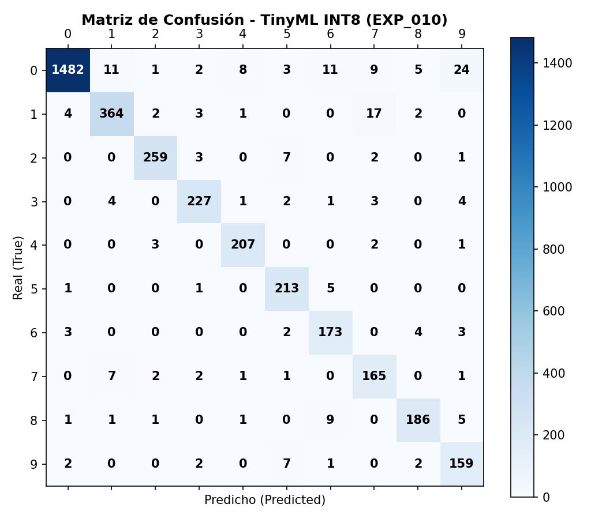

# 🔬 Reporte Detallado de Experimento - `EXP_009`

- **Fecha / Hora:** 2026-09-11 20:06
- **Notas / Cambios:** Escalado de capacidad a alpha=0.50 (Salto historico a 95.75% Acc INT8)

---

## 🎯 Hipótesis y Contexto del Experimento
El incremento a alpha=0.50 otorga suficiente capacidad convolucional para resolver las ambiguedades de curvatura en 7 vs 3 y 9 vs 8 sin superar el presupuesto de memoria (< 256 KB Flash y < 40 KB RAM).

---

## ⚙️ Hiperparámetros de Configuración

| Parámetro | Valor |
| :--- | :--- |
| **Multiplicador de Ancho ($\alpha$)** | `0.5` |
| **Dimensión de Entrada** | `64x32x1` |
| **Épocas de Entrenamiento** | `30` |
| **Tamaño de Batch** | `32` |

---

## 📊 Métricas Globales y Rendimiento

| Métrica | Valor | Objetivo TinyML |
| :--- | :--- | :--- |
| **Exactitud Float32** | `95.55%` | N/A |
| **Exactitud INT8** | **`95.75%`** | **> 85.0%** |
| **Pérdida por Cuantización** | `-0.2%` | **< 1.0%** |
| **Latencia Promedio por Imagen** | `0.042 ms` | **< 5.0 ms** |
| **Macro F1-Score** | `0.957` | Max |
| **Weighted F1-Score** | `0.957` | Max |
| **Tamaño en Flash (TFLite INT8)** | **`16.85 KB`** | **< 256 KB** |
| **RAM Estimada (Tensor Arena)** | **`15.05 KB`** | **< 40 KB** |

---

## 📈 Desglose por Clase (Classification Report)

| Clase | Precision | Recall | F1-Score | Muestras (Support) |
| :--- | :--- | :--- | :--- | :--- |
| Dígito '0' | 0.967 | 0.994 | **0.980** | 175 |
| Dígito '1' | 0.967 | 0.991 | **0.979** | 234 |
| Dígito '2' | 0.976 | 0.936 | **0.956** | 219 |
| Dígito '3' | 0.922 | 0.976 | **0.948** | 207 |
| Dígito '4' | 0.981 | 0.935 | **0.958** | 217 |
| Dígito '5' | 0.951 | 0.972 | **0.961** | 179 |
| Dígito '6' | 0.951 | 0.972 | **0.961** | 178 |
| Dígito '7' | 0.947 | 0.961 | **0.954** | 205 |
| Dígito '8' | 0.983 | 0.917 | **0.949** | 192 |
| Dígito '9' | 0.932 | 0.923 | **0.927** | 194 |
| **macro avg** | 0.958 | 0.958 | **0.957** | 2000 |
| **weighted avg** | 0.958 | 0.958 | **0.957** | 2000 |

---

## 🧩 Matriz de Confusión

```
True \ Pred |    0    1    2    3    4    5    6    7    8    9
----------------------------------------------------------------
 Digit '0'  |  174    0    0    0    0    1    0    0    0    0
 Digit '1'  |    0  232    0    0    0    2    0    0    0    0
 Digit '2'  |    1    1  205    2    0    0    3    6    1    0
 Digit '3'  |    0    0    1  202    0    2    0    2    0    0
 Digit '4'  |    0    1    0    0  203    0    3    0    1    9
 Digit '5'  |    0    0    0    4    0  174    0    1    0    0
 Digit '6'  |    2    2    0    0    1    0  173    0    0    0
 Digit '7'  |    1    3    2    2    0    0    0  197    0    0
 Digit '8'  |    2    0    2    4    0    1    3    0  176    4
 Digit '9'  |    0    1    0    5    3    3    0    2    1  179
```

### Visualización Gráfica



---

## 💡 Conclusiones y Aprendizajes

Exito rotundo: se alcanzo 95.75% de exactitud INT8 (+3.30% respecto a EXP_008). La confusion de 7 hacia 3 cayo de 13 muestras a solo 2 muestras. Todas las clases superan el 92.7% de F1-score con solo 16.85 KB de Flash.
